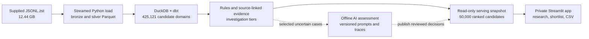

# WeLook — cybersecurity account research

WeLook turns the supplied internet-service observations into an evidence-backed prospect queue for a team selling external attack-surface monitoring. Reps can filter candidate domains, inspect why an account appears, move uncertain cases to research, save a session shortlist, and export a CSV brief. Technical observations are leads for investigation, not confirmed vulnerabilities or buying intent.

**Hosted app:** [welook.streamlit.app](https://welook.streamlit.app/). The app is deployed from `main` and currently private; Firmable reviewers need a Streamlit viewer invitation. The app also runs locally from the committed serving snapshot.

## How it works



The solid path is running end to end. The optional AI workflow is offline; no AI assessments are in the hosted snapshot yet. See the [system architecture](docs/architecture.md) for the data contracts, incremental-load behavior, and cost controls.

## What has been built

- Streamed the **entire 12.44 GB compressed source** into faithful bronze and typed silver Parquet: 11,768,718 source, bronze, and accepted silver rows; zero rejected rows; 656 bounded parts; 8.2-minute ingestion on a 48 GB laptop.
- Built 9,335,329 domain-observation evidence links and 425,121 candidate domains with DuckDB/dbt. All 14 dbt model/test steps passed on the full run.
- Exported a 21.2 MB read-only serving snapshot with the top 50,000 candidates and 96,113 selected evidence rows. The app states that the hosted view is a ranked subset of the full processed universe.
- Deployed the Streamlit account queue, research queue, evidence detail, session shortlist, and CSV export; verified the hosted app starts against the full serving snapshot.
- Added a reusable account-research skill, two prompt versions, and budgeted/traced offline API code. A labelled evaluation set and prompt-quality results are **not included**, so the AI assessment is not presented as validated.

The source file, full bronze/silver data, analytical build database, API secrets, and raw traces are not in Git. The compact serving snapshot is included for a reproducible app demo.

## Run locally

Requires Python 3.12, [uv](https://docs.astral.sh/uv/), and the `zstd` command for the full compressed input. Place the supplied file at `b2_download_file_by_id` in this repo, or pass its path with `--input`.

```bash
uv sync --locked --cache-dir .uv-cache
uv run python scripts/run_pipeline.py
uv run streamlit run app/app.py
```

The pipeline registers immutable source-file checksums. A repeated completed file is skipped at ingestion; adding a second file appends its silver parts to the registered source and refreshes the derived dbt tables and serving snapshot. A two-file/retry fixture exercises this behavior. A replacement snapshot or deletion requires a separate source contract.

The repo also includes an earlier 5,000-row development loader in `scripts/load_sample.py`; it is not the full pipeline.

## Checks and AI workflow

```bash
uv run python -m unittest discover -s tests -v
```

The optional AI workflow selects ambiguous accounts offline. `uv run python scripts/enrich_accounts.py --limit 100` previews selected evidence bundles without an API call. After setting `OPENAI_API_KEY` in the ignored `.env`, `--live` makes budgeted calls and writes local traces. Outputs require manual verification before use; no labelled quality evaluation is supplied. Publishing cached decisions in the app would require a quality review first. API billing is separate from a ChatGPT/Codex subscription.

## Submission documents

- [Planning and sales use cases](docs/planning.md)
- [System architecture](docs/architecture.md) and [detailed engineering notes](docs/architecture-notes.md)
- [Skill](skills/account-research/SKILL.md) and [prompts](prompts/account-research/)
- [How I built it reflection](docs/how-i-built.md)

The candidate domain is an evidence grouping key, not a resolved legal entity. Shared platforms, CDN infrastructure, scanner labels, and missing firmographics remain visible limitations.
