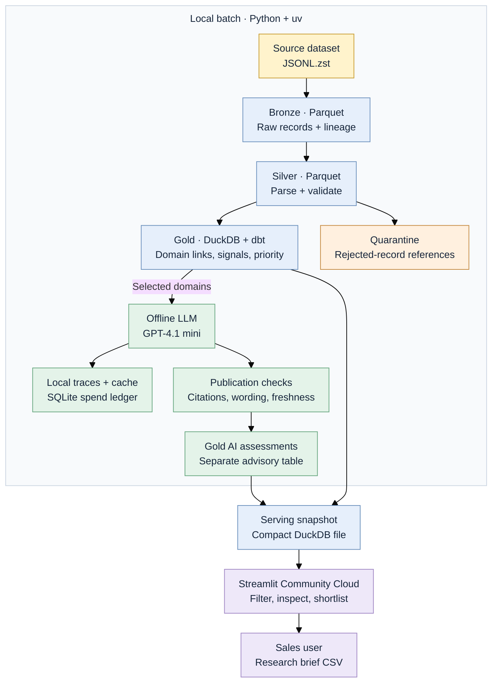

# WeLook

**Cybersecurity account research for sales teams.** WeLook turns the supplied internet-service observations into a ranked list of candidate domains for a team selling external attack-surface monitoring. A rep can inspect the evidence, record a researched company identity, and export a shortlist for sales review.

**[Open the app](https://welook.streamlit.app/)** · [Architecture](docs/architecture.md) · [Planning](docs/planning.md) · [Development reflection](docs/how-i-built.md)

The pipeline processed all **11,768,718 observations** in the 12.44 GB compressed source and derived **425,121 candidate domains**. The hosted snapshot contains the top **50,000 domains**, **96,107 selected evidence rows**, and **46 published AI research notes**. These are historical research signals; they do not establish current vulnerabilities, verified company ownership, or buying intent.

## What you can do

- Filter a research queue by domain, priority view, scanner signal, domain-match strength, and product name in selected evidence.
- Inspect the observations and scanner-listed vulnerability IDs behind a candidate's priority.
- Read a cited offline AI note where one is available; rules determine priority for every candidate.
- Shortlist domains, save a research status and sourced company name, and download a cited CSV handoff. Shortlists and saved research updates last for the browser session only.
- Use the in-app **User Guide** for filter definitions and score explanations.

## Architecture



Heavy processing and AI calls run locally. The hosted app reads the exported snapshot; page views make no LLM calls. New immutable files append bronze/silver data, then rebuild the derived marts. Repeated completed files are skipped. See [architecture and operating commands](docs/architecture.md) for replay, quality gates, AI publication, and cost controls.

## Run the app

Requires **Python 3.12** and **[uv](https://docs.astral.sh/uv/getting-started/installation/)**. The bundled serving file is enough to run the demo; no source download or API key is needed.

```bash
git clone https://github.com/ronyabrah18/welook.git
cd welook
uv sync --locked
uv run streamlit run app/app.py
```

Open the local URL printed by Streamlit. To rebuild from the supplied dataset, install the `zstd` command and run:

```bash
uv run python scripts/run_pipeline.py --input /path/to/source.jsonl.zst
```

The build writes local data under `artifacts/` and replaces the serving snapshot after validation. Keep enough disk space for the source, Parquet layers, and warehouse. The full run was completed on a laptop with 48 GB RAM; that is an observed environment, not a minimum requirement.

## Configuration

| Setting | Purpose |
| --- | --- |
| `OPENAI_API_KEY` | Optional, for live offline AI batches/evals only. Copy `.env.example` to ignored `.env` and set the key locally. |
| `WELOOK_SERVING_DB` | Optional environment variable overriding the app's default `app/data/welook_serving.duckdb`. |
| `FIRMABLE_DB_PATH` | DuckDB path for direct dbt commands. The pipeline runner sets it automatically. |
| `.streamlit/config.toml` | App theme. |

Only the AI client loads `.env`. Export other environment variables in your shell when needed. Full source data, warehouse files, `.env`, and raw API traces are excluded from Git.

## How prioritisation works

| Priority | Rule |
| --- | --- |
| Investigate first | Matching website host and certificate, plus a scanner-verified label on the same observation. |
| Review next | A direct match with an unverified scanner label, and no directly matched verified label. |
| Needs research | Weaker evidence, including one-sided matches or admin/login titles. |
| Low evidence | Remaining candidates; available through All candidates. |

Priority sorts before the **research score**. The score uses the strongest observation's domain matches, scanner labels, page title, and product field; it is not a purchase probability. [Exact rules and weights](docs/architecture.md#prioritisation) are documented. AI notes never change the priority.

## Project structure

```text
app/          Streamlit UI, User Guide, CSV export, bundled serving data
scripts/      Profiling, ingestion, warehouse registration, AI and export commands
transform/    dbt SQL models and data tests
welook/       Shared LLM client and source-lineage utilities
skills/       Reusable, versioned account-research workflow
prompts/      Immutable account-research prompts v1–v5
evals/        25 draft-labelled cases, predictions, comparison harness and results
tests/        Pipeline, app, publication and LLM contract tests
docs/         Planning, architecture/costs, and development reflection
```

## Validation and AI evaluation

```bash
uv run python -m unittest discover -s tests -v
uv run python evals/run_eval.py
```

Both commands run without API calls. The eval command re-scores the committed v4/v5 predictions; [eval instructions](evals/README.md) explain live reruns. The [account-research skill](skills/account-research/SKILL.md) describes the reusable AI workflow.

V5 decision accuracy is 96% on the 25 selected cases, but the labels are Codex-proposed drafts awaiting independent human review. Its unverified-label prose passed the strict wording gate on **0 of 10** cases. See the [measured results and limitations](evals/results.md); this is a decision-policy comparison, not evidence of vulnerability-detection accuracy.

## Limitations and future improvements

- A domain is not a verified organisation. Server country, provider names, and scanner flags cannot establish customer identity or current exposure.
- Product search covers up to three selected observations per hosted domain, not a full technology inventory. Company territory, industry, contacts, and buying intent are unavailable.
- AI notes cover 46 selected domains. The app and its CSV are research aids; findings need human verification.
- Incremental loading supports immutable file arrivals. Corrections, deletions, persistent team shortlists, and scheduled operation are future work.

Next improvements would be independently reviewed eval labels, sourced business/operator enrichment, product aggregation across all evidence, and feedback from sales users. Account-level AI freshness checks and targeted mart updates would reduce repeat work for a recurring feed.
