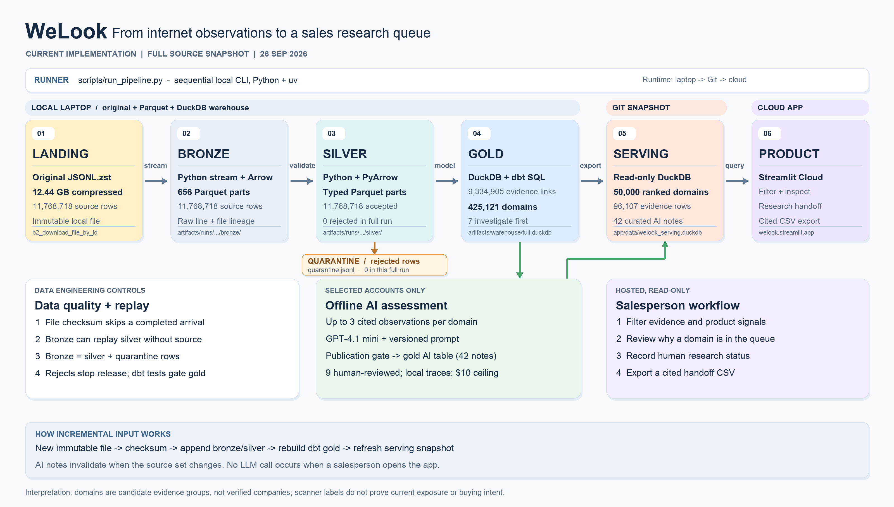

# WeLook — cybersecurity account research

WeLook turns the supplied internet-service observations into an evidence-backed candidate queue for a team selling external attack-surface monitoring. Reps start with a focused review queue, inspect the source observations, shortlist candidates, record a sourced company identity and research status, and export a cited CSV handoff. The strongest tier requires a scanner-verified label and a direct domain match on the same observation. A separate review-next tier contains direct matches with **unverified** scanner labels; a login page alone stays in research. Technical observations are leads for investigation, not confirmed vulnerabilities or buying intent.

**Hosted app:** [welook.streamlit.app](https://welook.streamlit.app/). The app is deployed from `main` and also runs locally from the committed serving snapshot.

## How it works



The diagram shows the **current implementation**, including the separate quarantine side output from silver validation, where each layer lives, and how counts change. Regenerate it from the serving report with [render_architecture_diagram.py](scripts/render_architecture_diagram.py).

The full data path is running end to end. A separate gold AI-assessment table holds 46 advisory offline research notes: 33 guarded batch notes for ambiguous accounts, four cautious direct-signal notes, two earlier reviewed examples, and seven individually reviewed `investigate_first` briefs. The serving snapshot copies only assessments for its hosted accounts. The rule-based queue remains authoritative. See the [system architecture](docs/architecture.md) for the data contracts, incremental-load behavior, and cost controls.

## What has been built

- Streamed the **entire 12.44 GB compressed source** into 656 bronze Parquet parts, then read those parts to build typed silver Parquet: 11,768,718 source, bronze, and accepted silver rows; zero rejected rows. The full v2 run took 3.4 minutes for bronze and 6.0 minutes for silver on a 48 GB laptop. Malformed records remain in bronze and are routed to a separate quarantine during silver validation.
- Built 9,334,905 distinct domain-observation evidence links and 425,121 candidate domains with DuckDB/dbt. The final account model and its tests passed against the full-data warehouse. The `investigate_first` rule requires a direct match and scanner-verified association on the same observation: 7 candidates qualify. Another 5,411 have a direct match and an unverified scanner label on the same observation; they enter `review_next`, with the finding explicitly marked for verification. Weaker matches and login-only cases remain in research.
- Exported an approximately 26 MB read-only serving snapshot with the top 50,000 candidates and 96,107 selected evidence rows. The app states that the hosted view is a ranked subset of the full processed universe.
- Deployed a single-page Streamlit explorer that opens on the focused review queue, with a product-name filter, cited evidence, scanner-listed vulnerability IDs to verify, a session shortlist, and a CSV handoff. Every `review_next` candidate shows the observation and scanner-listed IDs behind its tier. A rep can record a researched company name and its source URL. The app requires both before a candidate can be marked **Ready for sales review**; this status never means confirmed service ownership or permission to contact. Session decisions are not persisted on the server.
- Added a reusable account-research skill, five prompt versions, and budgeted/traced offline API code. Of 100 earlier v2 batch outputs, 33 cautious notes passed the publication gate and 67 overconfident `supported` outputs were withheld. A new 100-account v5 batch on direct matches cost US$0.054862 in recorded API usage; four notes passed the stricter wording gate and 96 were withheld because their phrasing could imply a confirmed vulnerability. Seven v4 top-tier drafts were reviewed and edited before publication. A separate gold table stores published notes; raw responses and traces remain local. AI notes do not change account priority.
- Added a 25-case account-research eval with 22 source-derived bundles and three marked negative controls. On the same cases and pinned model, v5 improved decision accuracy from 60% (v4) to 96% and supported-decision precision from 41.2% to 100%. None of the ten unverified-direct v5 notes passed the strict wording gate, so this result supports the decision improvement but **not** automatic publication of prose. The exact outputs and limits are in [evals](evals/README.md).

The source file, full bronze/silver data, analytical build database, API secrets, and raw traces are not in Git. The compact serving snapshot is included for a reproducible app demo.

## Run locally

Requires Python 3.12, [uv](https://docs.astral.sh/uv/), and the `zstd` command for the full compressed input. Place the supplied file at `b2_download_file_by_id` in this repo, or pass its path with `--input`.

```bash
uv sync --locked --cache-dir .uv-cache
uv run python scripts/run_pipeline.py
uv run streamlit run app/app.py
```

The pipeline registers immutable source-file checksums. A repeated completed file skips both bronze and silver; a completed bronze run can build or retry silver without the landing file. Run `uv run python scripts/run_pipeline.py --input /path/to/new-arrival.jsonl.zst` for each new immutable arrival. Its silver parts join the registered source, then dbt rebuilds the account marts, validates curated AI notes into a separate gold table, and atomically replaces the serving snapshot. When a source is rebuilt with a newer schema, DuckDB registers only the latest complete version. An end-to-end two-file fixture checks account updates, duplicate-domain normalization, idempotence, and invalidation of stale AI notes. A replacement snapshot or deletion requires a separate source contract.

## Checks and AI workflow

```bash
uv run python -m unittest discover -s tests -v
```

The one-command prompt comparison is `UV_CACHE_DIR=.uv-cache uv run --no-sync python evals/run_eval.py --live` after configuring the ignored API key; it uses the shared US$10 ledger and cached responses. `UV_CACHE_DIR=.uv-cache uv run --no-sync python evals/run_eval.py` re-scores the committed outputs for free. Review the proposed case labels in [label_review.md](evals/label_review.md) before describing them as independently human-validated.

The optional AI workflow now selects `review_next` accounts by default. `uv run python scripts/enrich_accounts.py --limit 100` previews bundles without an API call, retaining only accounts whose displayed evidence contains the direct scanner label. Use `--segment ambiguous` for partial matches or `--segment investigate_first --limit 7` for the strongest current tier. After setting `OPENAI_API_KEY` in the ignored `.env`, `--live` makes budgeted calls and writes local traces. `uv run python scripts/publish_assessments.py` extracts only cautious batch outputs and combines them with individually reviewed examples. `scripts/register_ai_gold.py` checks citation visibility, supported attribution, review status, and source freshness before publishing `analytics.account_ai_assessments`; `scripts/export_serving.py` then copies the hosted subset. Raw local outputs never publish automatically. API billing is separate from a ChatGPT/Codex subscription.

## Submission documents

- [Planning and sales use cases](docs/planning.md)
- [System architecture](docs/architecture.md)
- [Skill](skills/account-research/SKILL.md) and [prompts](prompts/account-research/)
- [Labelled eval, harness, and measured results](evals/README.md)
- [How I built it reflection](docs/how-i-built.md)

The candidate domain is an evidence grouping key, not a resolved legal entity. Shared platforms, CDN infrastructure, scanner labels, and missing firmographics remain visible limitations.
