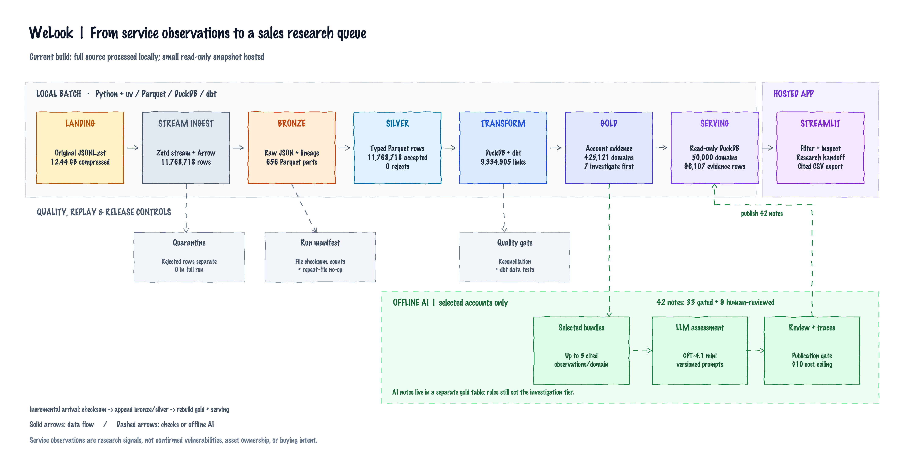

# WeLook — cybersecurity account research

WeLook turns the supplied internet-service observations into an evidence-backed candidate queue for a team selling external attack-surface monitoring. Reps can filter candidate domains, switch to direct domain matches, inspect why an account appears, shortlist it, record a research status and note, and export a cited CSV handoff. The direct-match switch uses host and certificate rules; it does not verify business identity. The strongest priority tier requires a scanner-verified association and a direct domain match on the same observation; a login page alone stays in research. Technical observations are leads for investigation, not confirmed vulnerabilities or buying intent.

**Hosted app:** [welook.streamlit.app](https://welook.streamlit.app/). The app is deployed from `main` and also runs locally from the committed serving snapshot.

## How it works



The sketch shows the **current implementation** and is backed by an [editable Excalidraw file](docs/diagrams/welook-architecture.excalidraw). Its PNG preview comes from [render_excalidraw_preview.py](scripts/render_excalidraw_preview.py). A [clean presentation PNG](docs/diagrams/architecture_diagram.png), generated from the serving report with [render_architecture_diagram.py](scripts/render_architecture_diagram.py), adds physical paths for each layer.

The full data path is running end to end. A separate gold AI-assessment table holds 42 advisory offline research notes: 33 guarded batch notes for ambiguous accounts, two earlier reviewed examples, and seven individually reviewed `investigate_first` briefs. The serving snapshot copies only assessments for its hosted accounts. The rule-based queue remains authoritative. See the [system architecture](docs/architecture.md) for the data contracts, incremental-load behavior, and cost controls.

## What has been built

- Streamed the **entire 12.44 GB compressed source** into 656 bronze Parquet parts, then read those parts to build typed silver Parquet: 11,768,718 source, bronze, and accepted silver rows; zero rejected rows. The full v2 run took 3.4 minutes for bronze and 6.0 minutes for silver on a 48 GB laptop. Malformed records remain in bronze and are routed to a separate quarantine during silver validation.
- Built 9,334,905 distinct domain-observation evidence links and 425,121 candidate domains with DuckDB/dbt. The final account model and its four dbt tests passed against the full-data warehouse. The `investigate_first` rule requires a direct match and scanner-verified association on the same observation: 7 candidates qualify. Another 28 domains have a verified label only on a different, indirectly linked observation and stay in research. Login/admin cases without direct verified evidence also stay in research.
- Exported an approximately 22 MB read-only serving snapshot with the top 50,000 candidates and 96,107 selected evidence rows. The app states that the hosted view is a ranked subset of the full processed universe.
- Deployed a single-page Streamlit candidate explorer with research and AI-note views, a product-name filter over selected evidence, an evidence-backed account brief, a session shortlist, and a cited CSV handoff. A rep can add a research status and note for each shortlisted candidate; the export includes up to three source evidence IDs, any published AI note, and the rep's next-step notes. Session decisions are not persisted on the server.
- Added a reusable account-research skill, four prompt versions, and budgeted/traced offline API code. Of 100 v2 batch outputs, 33 cautious notes passed the publication gate and 67 overconfident `supported` outputs were withheld. Seven v4 top-tier drafts were reviewed and edited before publication to distinguish historical scanner labels from confirmed current vulnerabilities. A separate gold table stores the published research notes, while raw responses and traces remain local. AI notes are advisory and do not change account priority.

The source file, full bronze/silver data, analytical build database, API secrets, and raw traces are not in Git. The compact serving snapshot is included for a reproducible app demo.

## Run locally

Requires Python 3.12, [uv](https://docs.astral.sh/uv/), and the `zstd` command for the full compressed input. Place the supplied file at `b2_download_file_by_id` in this repo, or pass its path with `--input`.

```bash
uv sync --locked --cache-dir .uv-cache
uv run python scripts/run_pipeline.py
uv run streamlit run app/app.py
```

The pipeline registers immutable source-file checksums. A repeated completed file skips both bronze and silver; a completed bronze run can build or retry silver without the landing file. Run `uv run python scripts/run_pipeline.py --input /path/to/new-arrival.jsonl.zst` for each new immutable arrival. Its silver parts join the registered source, then dbt rebuilds the account marts, validates curated AI notes into a separate gold table, and atomically replaces the serving snapshot. When a source is rebuilt with a newer schema, DuckDB registers only the latest complete version. An end-to-end two-file fixture checks account updates, duplicate-domain normalization, idempotence, and invalidation of stale AI notes. A replacement snapshot or deletion requires a separate source contract.

## Checks and AI workflow

```bash
uv run python -m unittest discover -s tests -v
```

The optional AI workflow selects ambiguous accounts offline. `uv run python scripts/enrich_accounts.py --limit 100` previews selected evidence bundles without an API call. Use `--segment investigate_first --limit 7` to prepare the strongest current tier for individual review. After setting `OPENAI_API_KEY` in the ignored `.env`, `--live` makes budgeted calls and writes local traces. `uv run python scripts/publish_assessments.py` extracts only cautious batch outputs and combines them with the individually reviewed examples. `scripts/register_ai_gold.py` checks citation visibility, supported attribution, review status, and source freshness before publishing `analytics.account_ai_assessments`; `scripts/export_serving.py` then copies the hosted subset. Raw local outputs never publish automatically. API billing is separate from a ChatGPT/Codex subscription.

## Submission documents

- [Planning and sales use cases](docs/planning.md)
- [System architecture](docs/architecture.md)
- [Skill](skills/account-research/SKILL.md) and [prompts](prompts/account-research/)
- [How I built it reflection](docs/how-i-built.md)

The candidate domain is an evidence grouping key, not a resolved legal entity. Shared platforms, CDN infrastructure, scanner labels, and missing firmographics remain visible limitations.
