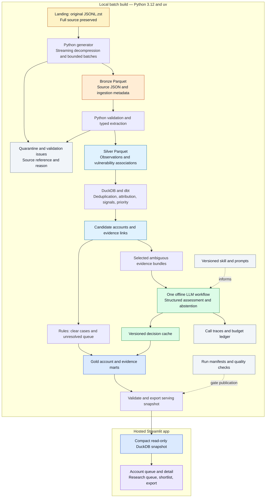

# WeLook architecture

Design v1 · 25 September 2026 · target submission 27 September 2026

**Status:** detailed design and implementation notes. Full bronze/silver ingestion, account models, and hosted Streamlit are complete. No labelled LLM quality evaluation is included. See the [short architecture](architecture.md) and README for current counts.

## 1. Product and scope

WeLook helps an outbound salesperson selling external attack-surface monitoring select accounts to investigate, understand evidence, and prepare relevant outreach. The user flow is **filter → prioritise → inspect evidence → shortlist → export a prospect brief**. It must be useful as a working hosted app, not just a pipeline demonstration.

Process the **entire supplied dataset**, not just the sample: 12,440,216,070 compressed bytes; 11,768,718 JSON objects; 88,527,136,570 decompressed bytes. The initial scan took 185.5 seconds on this machine; that is profiling performance, not a benchmark for the proposed ingestion or transformations.

The 5,000-record sample remains a development fixture. Full processing does not imply all records become accounts: rejected, unattributable, provider-only, and out-of-scope observations are retained with explicit counts and reasons. Every eligible candidate is considered by deterministic transformations; AI is restricted to a budgeted subset. The app labels rule-only, AI-assessed, and unresolved accounts.

## 2. Architecture diagram



The separate [editable diagram](diagrams/welook-architecture.mmd) contains the same flow.

## 3. Technology choices

| Concern | Choice | Reason and boundary |
| --- | --- | --- |
| Development | Python 3.12 + uv | Builds on existing Python experience; locked dependencies. |
| Ingestion | Generator + PyArrow batch writer | Full-file processing with bounded buffers and recoverable output parts. |
| Storage | Local landing file; Zstd-compressed Parquet | No cloud storage service needed during the take-home. Directory layout can later map to S3. |
| Analytical engine | DuckDB | Queries Parquet and builds compact analytical tables without a database server. |
| Transformations | Small dbt-duckdb project | SQL dependencies, tests, documentation; expand only as business logic requires. |
| Orchestration | Sequential Python CLI | Explicit stage dependencies and run manifests; no scheduler needed for one supplied snapshot. |
| AI | One provider adapter + structured output validation | Selective evidence interpretation; prompts, results, and costs versioned. |
| Interface | Streamlit | Python app with native tables, filters, detail views, and download buttons. |
| Hosting | Streamlit Community Cloud, subject to deployment checks | Free hosting with public/private GitHub integration. Only app dependencies and serving data ship. |
| Checks | Local one-command fixture and dbt data tests | CI can run these later; no full dataset or paid calls are needed for routine checks. |

PyArrow supports Parquet/Zstd writing ([documentation](https://arrow.apache.org/docs/python/parquet.html)). DuckDB's file access model motivates separate batch-build and read-only serving files ([concurrency documentation](https://duckdb.org/docs/lts/connect/concurrency)). Streamlit's free hosting is documented [here](https://docs.streamlit.io/deploy/streamlit-community-cloud); resource limits and hibernation must be checked during deployment ([limits](https://docs.streamlit.io/deploy/streamlit-community-cloud/manage-your-app)).

## 4. Landing and bronze: preserve the source

Landing is the original file, unchanged. Register its content checksum, byte count, source identifier, and receipt metadata. Do not rename or duplicate the existing file just to mimic a bucket. A manifest points to it. In production, this becomes an immutable S3 object plus version/checksum.

Bronze stores each valid UTF-8 JSON object as its **original JSON text**, not a reserialised subset, inside Parquet:

| Column | Purpose |
| --- | --- |
| `source_file_id` | Source compressed-content checksum |
| `source_line` | One-based logical line in decompressed source |
| `source_record_id` | Stable hash of file identity and source line |
| `raw_content_sha256` | Detect byte-identical record content |
| `ingestion_run_id`, `ingested_at` | Operational provenance; ingestion time is UTC |
| `raw_json` | Complete original record text, excluding record delimiter |

This preserves unknown nested fields and changing CVE keys. It does **not** provide typed column pruning inside `raw_json`; that benefit arrives in silver. Landing retains byte-for-byte fidelity, including line endings and malformed bytes. Bronze is an additional storage copy; its size must be measured, not assumed smaller than the original Zstandard frame.

A generator reads decompressed lines. Flush an Arrow batch at **10,000 records or 32 MiB of raw payload**, whichever comes first. Start by rotating Parquet files around 128 MiB of accumulated raw payload; measure resulting compressed file sizes and adjust. These are tuning targets, not guarantees on resident memory: Python objects and Arrow conversion add overhead. Enforce a per-record size guard, measure peak memory, and fail visibly on an oversized record rather than truncate it.

Use coarse partitions `source_file_id/run_id/part-N.parquet`; do not partition by account/IP/country. This snapshot has no demonstrated need for fine partitioning. Disable dictionary encoding for high-cardinality raw JSON if the measured result warrants it.

## 5. Silver contracts and validation

Python handles parsing and typed extraction once per completed bronze part. Bronze remains authoritative. Preserve enough evidence for later attribution: domains, hostnames, HTTP host/title, certificate subject and SANs when present, product/version, scanner module, infrastructure organisation/location, tags, original timestamp, and complete vulnerability metadata. No wholesale web HTML or banner text goes to the app or model.

| Dataset | Grain and key | Important fields |
| --- | --- | --- |
| `observations` | One source observation; `source_record_id` | Address family, normalised IP, port, transport, observed time, provenance, typed evidence |
| `observation_vulnerabilities` | Observation + CVE | Verification value including unknown, severity/source attributes, original metadata |
| `account_candidates` | Candidate domain; versioned normalisation key | Display-name evidence, provider/platform status, business attributes with source or unknown |
| `account_observations` | Candidate + observation | Attribution method, supporting fields, contradictions, scope, review status |
| `signals` | Observation + signal code/version | Observed condition, evidence strength, timestamp, verification status |
| `ai_decisions` | Evidence hash + prompt/model/schema versions | Structured class, evidence references, reason, next action, trace ID |

Start with candidate domains, not a claim that domain equals legal company. Use registrable-domain parsing with a pinned suffix list and a private-suffix policy; do not use naive last-two-label splitting. Shared platform tenant identities remain separate/ambiguous. Deduplicate exact source content with an explicit mapping to retained observations; broader service-key conflicts require a documented policy, not silent dropping.

Required record checks: JSON object, valid IPv4 or IPv6, integer port in range, supported transport, parseable observation timestamp. Validate selected nested field types. Missing optional domains/company data is **valid but incomplete**. Wrong optional field types generate quality issues and unusable values for that feature; they need not discard an otherwise valid observation. Unparseable JSON/encoding and invalid core identity go to quarantine.

Preserve original timestamp strings. The supplied values have no explicit timezone: do not label them UTC. Derive date-based freshness at source precision; future timestamps get an issue flag. New fields are recorded in a schema-drift report and preserved in bronze. Unexpected types are counted and classified by affected contract field; do not treat dynamic CVE IDs as newly introduced schema columns.

Publication gates: no decompression failure; all source lines accounted for; unique keys; required fields and enums valid; child relationships valid; zero unexplained row loss. Any rejected core record marks the run `needs_review` until the exception summary is acknowledged in the run manifest. Do not hide it in a successful count.

Reconciliation before deduplication:

```text
source lines = bronze valid objects + landing parse/encoding rejects
bronze valid objects = typed accepted observations + core-contract rejects
typed accepted observations = distinct observations + duplicate mappings
```

## 6. Accounts, signals, and sales priorities

Rules screen known provider/platform domains and generic certificates; match domain/host/certificate evidence with correct hostname boundaries; retain all candidate associations. A match on shared infrastructure does not attribute every port on the IP to that account. Contradictions lead to review. A large infrastructure footprint is context, not proof of provider ownership.

Initial signals: dataset-associated vulnerabilities with verification flags; dataset EOL labels; recognised service/product categories; observed certificate expiry; web administration indicators supported by title/product metadata. A port alone is weak evidence. Self-signed certificates, provider scanner names, and public services are not automatic confirmed weaknesses. No claims of active exploitation or breach without supporting evidence. External vulnerability feeds are optional after the core workflow works; they do not independently verify an affected account.

Use transparent priority tiers first: `investigate_first` for supported attribution plus relevant evidence; `research` for unresolved ownership or meaning; `low_evidence` when no qualifying signal is established. Within a tier, sort by explicit, versioned signal weights, distinct signal categories, then recency. Final weights are set after reviewing real cases; label the number an investigation score, not purchase probability. Do not reward duplicated scans or equate missing data with security.

Keep separate columns for attribution status, technical relevance, evidence strength, and contact readiness. Infrastructure geography is not company territory. Territory/sector/size are only populated from attributable enrichment, otherwise `unknown`. The app can filter infrastructure geography with that precise label. Suggest buyer roles, not invented named contacts. A reviewed website/contact URL can be recorded with its source; otherwise the next action is contact research.

## 7. One bounded LLM workflow

Feature: assess whether a proposed account association is supported by the supplied heterogeneous evidence and explain the next research step. Rules do exact validation and matching; the LLM addresses semantic ambiguity such as provider names versus business titles. It cannot verify present ownership through reasoning alone.

Input: candidate domain, selected observation IDs, compact title/certificate/provider snippets, rule flags, and conflicting evidence. Output: `supported`, `needs_review`, or `insufficient_evidence`; evidence IDs; concise explanation; unresolved questions; next action. `supported` means supported within the supplied bundle, not externally confirmed. Schema checks also ensure referenced IDs belong to the input. Treat all extracted text as untrusted content, never instructions.

Run offline on selected candidates with useful technical evidence. Initial capacity target: up to 1,000 unique bundles, with actual coverage reported. Cache key includes evidence hash, prompt hash/version, model snapshot, and output-schema version. A candidate outside the AI quota remains rule-only; it is not dropped from the account universe.

Cheap model first; a stronger model would require a future quality evaluation before use. Missing evidence goes to human research. Refusals, invalid outputs, timeouts, exhausted budget, and terminal failures get distinct statuses. No failed result disappears silently.

## 8. AI traces, skills, and spending

Create a versioned `skills/account-research/SKILL.md` with trigger, contract, prompt dependencies, and example. Keep immutable `prompts/account-research/v1.md` and `v2.md`; create versions as actual iteration occurs.

The requested hand-labelled examples, one-command comparison harness, and measured quality results are not included. This is a known gap against the take-home requirements. Until an evaluation is added, outputs remain advisory and cannot promote an account to outreach-ready status.

Every call logs request/response (selected, sanitised evidence), request/attempt IDs, model snapshot, prompt hash/version, timestamps, latency, token usage, rate-card version, cost, decision, schema-validation result, error, and cache key. Append JSONL traces; use a local transactional budget ledger for reservations. Raw traces remain local/ignored.

**User-selected take-home API ceiling: US$10 total**, including retries, development, and any enrichment. Candidate rates checked 25 September 2026:

| Candidate model | Input / 1M tokens | Output / 1M tokens | Intended use |
| --- | ---: | ---: | --- |
| GPT-4.1 mini | $0.40 | $1.60 | Experimental structured classifier |
| GPT-4.1 | $2.00 | $8.00 | Possible future comparison |

Sources: [mini](https://developers.openai.com/api/docs/models/gpt-4.1-mini), [stronger model](https://developers.openai.com/api/docs/models/gpt-4.1). These are candidate models, not a claim of best performance. No provider-cache or batch discounts assumed.

Illustrative workload at 2,000 total input tokens and 400 output tokens per call:

```text
mini: (2,000 × $0.40 + 400 × $1.60) / 1,000,000 = $0.00144/call
1,100 development or enrichment calls = $1.584
50 stronger-model calls × $0.0072 = $0.360
Base estimate = $1.944; with 25% retry allowance = $2.430
```

This is an estimate, not a bill. Configure 2,500 input / 500 output token caps and reserve worst-case cost before dispatch; retain the reservation when a timeout leaves usage unknown. At those caps the same 1,150-call workload is $2.43 before retry allowance. Refuse a new request if completed plus reserved spending would exceed $10. All invocations share the persistent ledger. Changing models also requires an updated rate card.

Production illustration: 1,000 changed/new bundles per day × 30 days × $0.00144 = $43.20 monthly for mini calls alone. An initial $50/month limit would require deferring work when calls or retries exhaust it. It is a proposed limit, not an estimate of the company's workload. Most importantly, no LLM is called per raw service record or app page view.

## 9. Serving and hosting

Build a separate read-only `welook_serving.duckdb` containing account summaries, signal summaries, selected evidence, cached assessments, and a dataset/build manifest. Include all eligible account summaries where measured size permits; selected detail rows may be capped with total counts and an explicit truncation marker. Never describe a hosted subset as the full universe. Target a serving artifact below 50 MB initially; measure before deciding transport. This target is not a measured size.

Only export explicit serving columns. Do not ship raw banners, private contact strings discovered in banners, landing/bronze, or trace requests. If small enough, version the sanitised serving artifact in the private Git repo. If larger, use versioned downloadable parts with checksums; keep API credentials out of browser code and account for any hosting/storage cost before adopting another service.

Streamlit reads the snapshot with read-only connections and paginated queries. It never runs ingestion, dbt, or paid LLM calls. Show the snapshot date, source/accepted/rejected/account counts, AI coverage, and limitations. In the prototype, shortlist and review actions live in per-user session state and can be downloaded/reimported; they are not durable shared CRM writes. Label that behaviour. A separate transactional store belongs in a later multi-user version.

Deployment checks: clean app-only dependency install, initial cold start, query latency and memory with the real serving data, filter/detail/export flow, valid links, no exposed secrets, and access from a reviewer browser. Private source-code visibility and app access are separate settings. Test the chosen reviewer-access mode and account for host hibernation before submission.

## 10. Recovery, operations, and scale path

Each stage writes into a new run directory and produces a manifest containing input checksum, code/schema/config versions, row counts, output checksums, elapsed time, peak memory, and status. Promote only completed, reconciled outputs. Keep the last good serving snapshot if a later build fails. Never expose partial output globs as completed datasets.

For future incremental arrivals, key the manifest by immutable source-file ID and checksum. A successful repeat is a no-op when file and processing versions match; an incomplete run resumes from completed bronze parts. Bronze is append-only per source file, while silver keeps source-line identity and explicit cross-file duplicate mappings. New/changed evidence identifies affected candidate accounts for gold recomputation and AI-cache invalidation. A replacement full snapshot or deletions require a separately defined source contract and retraction/snapshot-diff process. The first supplied snapshot is still a full load. Verify this contract with a two-file fixture and a repeated-run no-op.

The source is one Zstandard frame: restart of landing-to-bronze may require re-decompressing from the beginning. Do not claim random seeking or per-record source resume. Once bronze parts are complete, downstream processing can resume per part. Skip an already-completed identical stage only when its input/config/code hashes match. Document intentional full rebuilds for changed transformation rules.

Log rows/sec, bytes, accepted/rejected counts, required-field failures, optional-field coverage, distinct domains, attribution/abstention distributions, and AI cost/latency. Schema and distribution comparisons are future drift checks when another snapshot arrives; this single snapshot cannot measure temporal drift.

Production mapping: S3 for immutable data and manifests; Batch/ECS for Python stages; Airflow for schedules/dependencies; Snowflake for typed transformations and marts; GitHub Actions plus Terraform for deployment. SQL dialect, load methods, data types, materialisations, and performance require adaptation and tests. This take-home does not demonstrate production Snowflake performance or billions-row scale.

## 11. Build order and completion evidence

1. **Full ingestion:** implement generator, faithful bronze, typed silver, quarantine, manifests, and bounded writes. Test fixtures/sample; run the full file and reconcile all 11,768,718 records.
2. **Account pipeline:** implement a small dbt graph for deduplication, candidate/evidence links, signals, and transparent priority. Review ten diverse real cases manually.
3. **Early app:** export rule-derived accounts and deploy filters, detail, shortlist, and CSV download. Clearly mark AI pending during development.
4. **Optional AI:** skill, versioned prompts, trace/budget wrapper, and cached enrichment adapter exist; no labelled quality evaluation or published app decisions are included.
5. **Submission:** test hosted flow, freeze versions, record actual counts/cost/performance, finish reflection and architecture status, check reviewer access, optional short walkthrough.

The full-data foundation and hosted app are complete. Reviewer access remains to be checked. The missing labelled evaluation is an explicit submission limitation.

## 12. Decisions and acknowledged limits

- Python, SQL, dbt, and CI keep the prototype reproducible and its data contracts visible.
- WeLook preserves verification metadata and separates account attribution from infrastructure identity.
- No Kubernetes, Spark cluster, vector database, orchestration server, paid warehouse, or separate API service is needed for this one-file prototype.
- Evidence is observational and potentially stale. The source spans about 76 minutes on one date; no historical growth, newly exposed condition, or confirmed buying intent can be derived from it.
- Read-only hosting, partial contact/firmographic coverage, uncertain ownership, and absent LLM quality evaluation are explicit limitations, not hidden assumptions.
