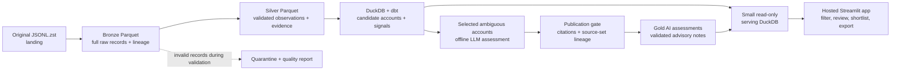

# WeLook: system design

**Design v2 · 26 September 2026.** The full source has been ingested and modelled locally. The Streamlit app is deployed against the full-run serving export at [welook.streamlit.app](https://welook.streamlit.app/). The serving snapshot contains 35 advisory offline AI notes.

## What the salesperson gets

WeLook is a single-page account-research tool for a team selling **external attack-surface monitoring**. A rep filters candidate domains, selects a row, sees a brief explaining why it merits investigation and what to verify, then shortlists or exports a cited research brief. Research and AI-note views are filter presets within the same queue. A candidate domain is not a verified organisation, and the app does not claim that a business is vulnerable or ready to buy solely because a service was observed.

The supplied snapshot is the core dataset: **11,768,718 service observations** in a 12.44 GB Zstandard-compressed JSONL file. The 5,000-row sample is for development only; the batch pipeline processes the full file. One service observation is not one company. Provider-owned infrastructure, shared hosting, and ambiguous domains require special care.

## Data flow

An [editable Excalidraw version](diagrams/welook-architecture.excalidraw) is available for walkthroughs.

All heavy processing happens in a **local, repeatable batch command**. The hosted app only reads a compact serving snapshot. This keeps hosting simple and avoids running the 12.44 GB ingestion or paid model calls on page views.

| Layer | Grain and responsibility | Key control |
| --- | --- | --- |
| Landing | Original compressed file, unchanged | Record file checksum and byte count. |
| Bronze | One source line per row of Parquet, with original UTF-8 text or undecodable bytes | Keep source file ID, line number, run ID, and content hash. No parsing or dropped source lines. |
| Silver | One validated, typed observation per accepted source row | Read completed bronze parts, check core fields, keep selected nested data and vulnerability JSON, quarantine rejects. |
| Gold | Candidate accounts, account-observation evidence links, rule-derived priority, and a separate validated AI-assessment table | Keep provenance, match strength, provider status, and source-set freshness. |
| Serving | Compact account queue, selected evidence, and the hosted subset of gold AI notes | Publish only after reconciliation, citation, and freshness checks pass. |

The Python runner has two explicit, bounded stages. It streams the Zstandard source into bronze and publishes a bronze manifest. Only then does silver read the completed bronze Parquet parts, parse and validate each record, and publish silver plus a quarantine side output. Memory does not scale with the full decompressed 88.5 GB. Reconcile `source lines = bronze rows` and `bronze rows = silver rows + parse rejects + core rejects`; dbt staging then deduplicates exact content hashes. Each stage records the source hash, schema version, counts, and elapsed time. A failed build leaves the last good serving snapshot intact. A failed landing-to-bronze run may need to decompress the single Zstandard frame again; a completed bronze run lets silver replay without the landing file.

### Validation contract and tool choices

Validation is layered: bronze preserves every source line, including malformed JSON or undecodable bytes; silver sends parsing and invalid core IP/port/transport/timestamp failures to a separate `quarantine.jsonl` with source identity and reason. PyArrow enforces the typed silver Parquet schema; dbt tests check model-level uniqueness, required fields, accepted values, and valid vulnerability JSON. The offline AI result has a strict JSON output schema plus evidence-ID checks. The silver manifest records counts and optional-field type issues, so an accepted row is not confused with a clean optional field.

Pydantic would be reasonable for a small configuration or API boundary, but running a second Python object validator over all 11.8 million observations would duplicate the current core checks without a clear benefit. Similarly, pandas is useful for small exploratory tables, but the full pipeline already streams bounded Arrow batches and computes aggregates in DuckDB. The one-command runner expresses the actual one-snapshot build. If this became a scheduled feed, an **Airflow DAG** could call the bronze, silver, register, dbt, and export stages in dependency order; a scheduler and metadata service are not needed for this take-home run.

### Incremental-load contract

Treat each future arrival as an **immutable source file**. Register its checksum and source identifier first. If that file and processing version are already complete, skip bronze and silver. Append its new bronze/silver parts, then register completed arrivals together in one DuckDB transaction; when a source is reprocessed under a newer schema version, register only the newest complete version. The prototype **rebuilds the derived dbt tables** from cumulative silver on a new arrival; the full build took about 1.7 minutes in the latest run. Account evidence is deduplicated after domain normalisation, and citations use the globally unique source-record ID, so source line 1 in two files cannot collide. A two-file integration test checks the resulting gold account counts and serving evidence, not just ingestion counts. This is incremental **source loading** with a full derived-mart refresh. A targeted gold refresh would be a later optimisation.

Offline AI notes carry a hash of the immutable source-file set used for their assessment. After each dbt build, `register_ai_gold.py` validates curated notes against gold account evidence and publishes current notes to `analytics.account_ai_assessments`; `analytics.ai_assessment_build_info` records the source-set hash and stale count. The serving export refuses an out-of-date gold AI build and copies only notes for its hosted accounts. When another file arrives, stale notes are removed from gold and the serving snapshot, while the rule-based queue stays available. This is conservative: it invalidates even notes for unaffected accounts. A larger recurring feed should use an account-level evidence fingerprint to reassess only changed accounts and retain unchanged notes. The current approach favours correct lineage and bounded cost for this small prototype.

The supplied data is one snapshot, so **initial delivery is a full load**. A later full replacement snapshot, correction, or deletion would need an explicit source contract and snapshot-diff/retraction logic; append-only arrivals alone cannot prove which old observations have disappeared. A small fixture demonstrates a first load, a repeated no-op, a second file, malformed-record quarantine, and silver replay from bronze after removal of the landing file.

This prototype uses one schema version for the source run and silver contract. A future silver-only rule change would need an explicit rebuild/version policy; today, a new schema version creates a new run and registers only its latest complete result. This keeps the take-home runner simple while preserving the bronze-to-silver boundary and recovery from an incomplete silver stage.

## Account logic and priorities

Domains, hostnames, HTTP host/title, certificates, product names, provider organisation, ports, timestamps, and vulnerability metadata are **evidence**, not proof of company ownership. Candidate accounts begin with attributable domains; an account-observation link stores the match method and contradictions. A provider's IP or cloud region is not automatically the customer's asset or sales territory. Missing company size, sector, contacts, and location remain `unknown` unless sourced separately.

Deterministic rules normalise and deduplicate observations, identify provider/shared-hosting patterns, derive technical signals, and calculate a transparent investigation tier. The implemented signals use dataset vulnerability associations with their `verified` flags, product context, and administration/login page titles. Other proposed signals, such as EOL and certificate expiry, remain future work. On the full account model, 222,307 account-observation links carry vulnerability labels, but only 1,335 carry a scanner-verified label; neither number is a count of confirmed affected companies. Show the observation date, verification flag, and source evidence. Repeated scans cannot inflate a score; missing vulnerability metadata does not mean safe.

The queue uses three practical states: **investigate first** (a direct domain match and scanner-verified vulnerability association on the same observation), **research** (weaker evidence, including admin/login titles without scanner verification or verified labels on indirectly linked observations), and **low evidence**. This same-observation condition prevents combining unrelated services into a strong signal: 7 candidates qualify, while 28 with a verified label only on another observation remain in research. These tiers do not assert a confirmed vulnerability or verified business ownership. The score is an investigation aid, not a probability of purchase. The rep can filter by technical signal, attribution, priority, and candidate domain. Observation dates and infrastructure country appear in evidence detail; company territory is unknown. The source covers only a short snapshot window, so a recency or territory filter would be misleading.

The app offers a **Direct domain matches only** toggle. It retains accounts with matching HTTP-host and certificate evidence and removes partial, unresolved, and known provider-only matches from the current view. The conservative provider list includes `1blu.de`, whose [official site identifies it as a hosting provider](https://www.1blu.de/); that domain had incorrectly ranked near the top before the list was updated. This is a rule-based evidence-strength filter, not a verified-business classifier: an unlisted infrastructure provider can still have matching host and certificate records for its own domain. The UI labels the main view a candidate queue and warns that business identity and service operation need confirmation before outreach. Firmographic or verified operator data would be needed to assert that a candidate is a target business. The toggle is off by default so the full hosted account set remains explorable.

## One bounded AI workflow

The LLM assesses a **small, selected account-evidence bundle** where rules cannot confidently interpret attribution. Each bundle contains up to three observations for one candidate domain, not one call per raw row. Its structured result is `supported`, `needs_review`, or `insufficient_evidence`, with source observation IDs, a short reason, and the next research step. `Supported` means the supplied evidence supports the association; it is not external verification. Invalid references or schema failures go to review. Every other eligible account still appears with a rule-only status. No LLM call happens on an app page view. The 100-account v2 batch produced 67 `supported` decisions that overstated what partial matches establish. We withheld all 67. The app's "AI notes" view exposes 33 cautious, guardrail-checked notes plus two separately reviewed cases; each also appears within its account brief. These 35 notes are a narrow offline sample, not AI coverage of all 425,121 candidate domains.

The workflow is packaged as `skills/account-research/SKILL.md` with its trigger, input/output contract, dependent prompts, and worked example. Immutable prompt files in `prompts/` support future comparison; v3 tightens attribution wording but has not been used for the published notes. `scripts/publish_assessments.py` extracts only `needs_review` and `insufficient_evidence` results from the local batch and combines them with two individually reviewed examples. Legacy one-file citations are migrated deterministically to globally unique source-record IDs using the original file checksum. The gold AI registrar then requires a cited source record among the same top-three evidence rows selected for the app. A `supported` note requires both HTTP-host and certificate-domain flags on a cited observation, cannot be provider-only, and cannot come from the unreviewed batch. This also addresses the earlier `mybigcommerce.com` provider false positive. The gold table holds the decision, short rationale, next action, citations, model/prompt version, review status, assessment time, and source-set hash; raw model responses and call traces remain outside gold. These checks enforce the data contract and citation rules. AI outputs remain research suggestions and do not change outreach eligibility.

Every model attempt writes a JSONL trace with request/evidence IDs, response, model, prompt/schema version, latency, token usage, calculated cost, validation outcome, and decision/error. Raw traces stay local; redacted examples and metrics can go in the repo. Cache results by evidence hash, prompt version, model, and schema version. Website and banner text are untrusted input, never instructions.

Trace contract, one JSON object per API attempt in ignored `artifacts/ai/traces.jsonl`: `call_id` and `at_utc` identify the attempt; `request.instructions` and `request.input` capture the prompt and evidence bundle; `model`, `prompt_version`, `prompt_sha256`, and `schema_version` identify the executable contract; `response`, `response_status`, `decision`, `validation`, and `error` record the outcome; `latency_ms`, `input_tokens`, `output_tokens`, `reserved_usd`, and `actual_usd` record performance and spend. A cache hit makes no API call and therefore creates no call trace. The SQLite ledger separately persists the reservation and final charge, including failed attempts whose usage is unknown.

**Spend ceiling: US$10 for the entire take-home**, including experiments, retries, and any offline enrichment. An illustrative first pass is 1,100 calls on GPT-4.1 mini at 2,000 input/400 output tokens each: `1,100 × ((2,000 × $0.40 + 400 × $1.60) / 1,000,000) = $1.584`. Fifty difficult cases on GPT-4.1 at the same sizes add `$0.36`; a 25% retry allowance gives approximately **$2.43**. These are [published mini](https://developers.openai.com/api/docs/models/gpt-4.1-mini) and [GPT-4.1](https://developers.openai.com/api/docs/models/gpt-4.1) rates checked for this design, not charges incurred. Reserve worst-case tokens before each call and refuse work that would exceed the $10 ledger.

For a production pilot, set a separate **US$25 rolling-month ceiling** and alert at US$15; this is a proposed policy, not an implemented production deployment. For example, 10,000 changed accounts assessed once per month at the measured short-bundle average of US$0.000303 would use about US$3.03 in model charges. Larger bundles, stronger-model escalations, and retries consume the remaining headroom. A scheduler should stop new LLM work at the ceiling while keeping the deterministic queue available. Never re-assess unchanged evidence hashes, and do not make model calls on app page views.

The 152 completed local mini-model calls used US$0.046088 in the ledger, about US$0.000303 per completed call. A separate 100-attempt local connectivity failure has US$0.138219 in conservative ledger reservations because actual API usage is unknown; those reservations are **not confirmed charges**. At the observed completed-call average, calling the model for all 50,000 hosted candidates would cost about US$15.16, before larger bundles, retries, or quality checks. A targeted 1,000-account review would be roughly US$0.30 at the same size. Neither volume nor budget can turn an evidence association into verified legal-business identity; the workflow therefore focuses on ambiguous cases rather than labelling the whole universe with an LLM.

## Why this stack and how it is hosted

| Component | Prototype choice | Reason |
| --- | --- | --- |
| Ingestion | Python generator + PyArrow | Familiar tools; bounded streaming and explicit validation. |
| Storage/analytics | Parquet + DuckDB | Full local dataset without warehouse fees or a database server. |
| Transformations | Small dbt-duckdb project | SQL models and data tests for the business logic; learn only what this pipeline needs. |
| Runner | Sequential CLI with run manifests | One supplied snapshot does not need Airflow. |
| App | Streamlit Community Cloud | Simple hosted, reviewer-accessible Python UI. Only the compact read-only serving file is deployed. |
| Checks | One-command local fixture and dbt data tests | Catch pipeline regressions without shipping raw data or spending API money. CI can run the same commands later. |

The app uses one discovery view: search, view/signal filters, a selectable candidate table, and an account brief with rule-derived rationale, verification step, likely buyer role, selected source evidence, and any advisory AI note. A sidebar holds the session shortlist; its CSV includes a source evidence ID, next action, and an explicit unverified-identity status. A session shortlist is temporary, so the UI says so. The serving export contains explicit sanitized fields, snapshot date, pipeline counts, and AI coverage. Keep the raw file, bronze/silver files, and model traces out of Git and hosting.

This local design maps cleanly to a future S3 landing/Parquet lake, scheduled container jobs, Snowflake marts, and Airflow orchestration, but that production stack is outside the take-home scope. The snapshot contains no time series, confirmed buyer intent, named contacts, or verified ownership for every service. Those limitations remain visible in the product.

## Build order and proof of completion

1. **Done:** stream the full file into bronze, rebuild silver from bronze, reconcile 11,768,718 rows, and exercise incremental, replay, and quarantine fixtures.
2. **Done:** build and test 425,121 candidate domains with dbt, then export an approximately 21 MB serving snapshot and run the Streamlit app locally.
3. **Done for the prototype:** the traced, budgeted offline AI adapter exists and 35 advisory notes are in the serving snapshot.
4. **Done:** Streamlit is deployed and the hosted queue runs.

The [planning document](planning.md) explains the sales use cases and desk research.
