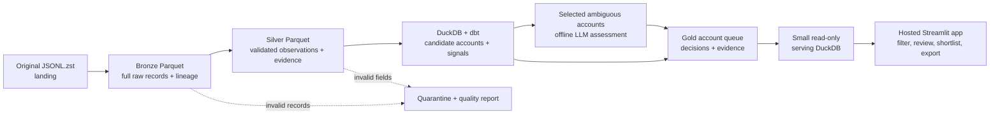

# WeLook: system design

**Design v1 · 25 September 2026.** The full source has now been ingested and modelled locally, and the Streamlit app runs against the full-run serving export. Hosted deployment, manual eval-label review, and paid LLM measurement remain outstanding.

## What the salesperson gets

WeLook is an account-research queue for a team selling **external attack-surface monitoring**. A rep filters candidate businesses, sees why each account deserves investigation, reviews the source observations and uncertainty, then shortlists or exports a prospect brief. The app also has a research queue for cases where ownership or technical meaning is unclear. It does not claim that a business is vulnerable or ready to buy solely because a service was observed.

The supplied snapshot is the core dataset: **11,768,718 service observations** in a 12.44 GB Zstandard-compressed JSONL file. The 5,000-row sample is for development only; the batch pipeline processes the full file. One service observation is not one company. Provider-owned infrastructure, shared hosting, and ambiguous domains require special care.

## Data flow

All heavy processing happens in a **local, repeatable batch command**. The hosted app only reads a compact serving snapshot. This keeps hosting simple and avoids running the 12.44 GB ingestion or paid model calls on page views.

| Layer | Grain and responsibility | Key control |
| --- | --- | --- |
| Landing | Original compressed file, unchanged | Record file checksum and byte count. |
| Bronze | One source line per row of Parquet, with original JSON text | Keep source file ID, line number, run ID, and parse errors. No dropped fields. |
| Silver | Typed observation plus separate vulnerability/evidence rows | Validate core fields, preserve unknown optional fields in bronze, quarantine bad core records. |
| Gold | Candidate account, account-observation links, signal, and priority | Keep provenance, conflicting matches, provider status, and rule/AI decision state. |
| Serving | One compact account queue with selected evidence | Publish only after reconciliation and quality checks pass. |

Python streams the Zstandard file line by line and writes bounded Parquet batches; memory should not scale with the full decompressed 88.5 GB. Reconcile counts at each boundary: source lines = bronze rows + parse rejects; bronze rows = accepted observations + core-contract rejects; accepted observations = distinct observations + recorded duplicates. Each run has a manifest with input hash, code/schema version, counts, errors, and output checksums. A failed run leaves the last good serving snapshot intact. The single Zstandard frame may need decompression from the start if landing-to-bronze fails; completed bronze parts allow downstream restart.

### Incremental-load contract

Treat each future arrival as an **immutable source file**. Register its checksum and source identifier first. If that file and processing version are already complete, skip its ingestion. Append its new bronze/silver parts, then register all completed arrivals together. The prototype **rebuilds the derived dbt tables** from cumulative silver on a new arrival; the full build took about one minute for this snapshot. Only the affected accounts need AI reassessment because their evidence hashes change. A targeted gold refresh would be a later optimisation. This makes repeated source ingestion idempotent without requiring a streaming service or warehouse.

The supplied data is one snapshot, so **initial delivery is a full load**. A later full replacement snapshot, correction, or deletion would need an explicit source contract and snapshot-diff/retraction logic; append-only arrivals alone cannot prove which old observations have disappeared. A small two-file fixture should demonstrate a first load, a repeated no-op, and a second file that updates one account without duplicating existing evidence.

## Account logic and priorities

Domains, hostnames, HTTP host/title, certificates, product names, provider organisation, ports, timestamps, and vulnerability metadata are **evidence**, not proof of company ownership. Candidate accounts begin with attributable domains; an account-observation link stores the match method and contradictions. A provider's IP or cloud region is not automatically the customer's asset or sales territory. Missing company size, sector, contacts, and location remain `unknown` unless sourced separately.

Deterministic rules normalise and deduplicate observations, identify provider/shared-hosting patterns, derive technical signals, and calculate a transparent investigation tier. The implemented signals use dataset vulnerability associations with their `verified` flags, product context, and administration/login page titles. Other proposed signals, such as EOL and certificate expiry, remain future work. On the full account model, 222,307 account-observation links carry vulnerability labels, but only 1,335 carry a scanner-verified label; neither number is a count of confirmed affected companies. Show the observation date, verification flag, and source evidence. Repeated scans cannot inflate a score; missing vulnerability metadata does not mean safe.

The queue uses three practical states: **investigate first** (relevant evidence and supported attribution), **research** (interesting evidence with unclear ownership or meaning), and **low evidence**. The score is an investigation aid, not a probability of purchase. The rep can filter by technical signal, attribution, priority, and candidate domain. Observation dates and infrastructure country appear in evidence detail; company territory is unknown. The source covers only a short snapshot window, so a recency or territory filter would be misleading.

## One bounded AI workflow

The LLM assesses a **small, selected account-evidence bundle** where rules cannot confidently interpret attribution. Its structured result is `supported`, `needs_review`, or `insufficient_evidence`, with source observation IDs, a short reason, and the next research step. `Supported` means the supplied evidence supports the association; it is not external verification. Invalid references or schema failures go to review. Every other eligible account still appears with a rule-only status. No LLM call happens per raw row or app page view.

This workflow will be packaged as `skills/account-research/SKILL.md` with its trigger, input/output contract, dependent prompts, and worked example. Immutable prompt files in `prompts/` allow v1/v2 comparison. A 25-case human-labelled set will cover credible matches, provider confusion, shared platforms, missing data, and misleading vulnerability evidence. The one-command eval will report per-class precision/recall, macro F1, evidence-reference validity, unsupported claims, and output coverage versus the previous prompt version. We will publish **actual measured results**, including failures, rather than claiming an improvement before testing.

Every model attempt writes a JSONL trace with request/evidence IDs, response, model, prompt/schema version, latency, token usage, calculated cost, validation outcome, and decision/error. Raw traces stay local; redacted examples and metrics can go in the repo. Cache results by evidence hash, prompt version, model, and schema version. Website and banner text are untrusted input, never instructions.

**Spend ceiling: US$10 for the entire take-home**, including experiments, evals, retries, and production-like enrichment. An illustrative first pass is 1,100 calls on GPT-4.1 mini at 2,000 input/400 output tokens each: `1,100 × ((2,000 × $0.40 + 400 × $1.60) / 1,000,000) = $1.584`. Fifty difficult cases on GPT-4.1 at the same sizes add `$0.36`; a 25% retry allowance gives approximately **$2.43**. These are [published mini](https://developers.openai.com/api/docs/models/gpt-4.1-mini) and [GPT-4.1](https://developers.openai.com/api/docs/models/gpt-4.1) rates checked for this design, not charges incurred or a model-quality conclusion. Reserve worst-case tokens before each call and refuse work that would exceed the $10 ledger. Final model selection follows the eval and available API access.

## Why this stack and how it is hosted

| Component | Prototype choice | Reason |
| --- | --- | --- |
| Ingestion | Python generator + PyArrow | Familiar tools; bounded streaming and explicit validation. |
| Storage/analytics | Parquet + DuckDB | Full local dataset without warehouse fees or a database server. |
| Transformations | Small dbt-duckdb project | SQL models and data tests for the business logic; learn only what this pipeline needs. |
| Runner | Sequential CLI with run manifests | One supplied snapshot does not need Airflow. |
| App | Streamlit Community Cloud | Simple hosted, reviewer-accessible Python UI. Only the compact read-only serving file is deployed. |
| Checks | One-command local fixture and eval validation checks | Catch ingestion/eval regressions without shipping raw data or spending API money. CI can run the same commands later. |

The app needs an account queue, evidence detail, research state, session shortlist, and CSV export. A session shortlist is temporary, so the UI must say so. The serving export contains explicit sanitized fields, snapshot date, pipeline counts, and AI coverage. Measure its actual file size, memory use, cold start, and reviewer access before submission. Keep the raw file, bronze/silver files, and model traces out of Git and hosting.

This local design maps cleanly to a future S3 landing/Parquet lake, scheduled container jobs, Snowflake marts, and Airflow orchestration, but that production stack is outside the take-home scope. The snapshot contains no time series, confirmed buyer intent, named contacts, or verified ownership for every service. Those limitations remain visible in the product.

## Build order and proof of completion

1. **Done:** stream the full file into bronze/silver, reconcile 11,768,718 rows, and exercise a two-file incremental fixture.
2. **Done:** build and test 425,121 candidate domains with dbt, then export a 21.2 MB serving snapshot and run the Streamlit app locally.
3. **Next:** manually review diverse real cases and the 25 draft eval labels, then measure v1/v2 with the traced, budgeted LLM workflow.
4. **Next:** refresh the serving snapshot with selected AI decisions, deploy Streamlit, verify reviewer access, and finish reflection/results.

The [planning document](planning.md) explains the sales use cases and desk research. [Detailed implementation notes](architecture-notes.md) record the schema, validation, recovery, cost, and deployment decisions behind this short design.
